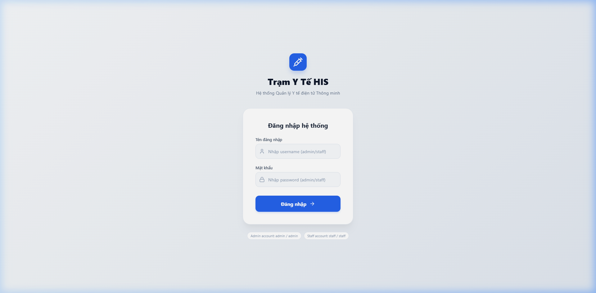
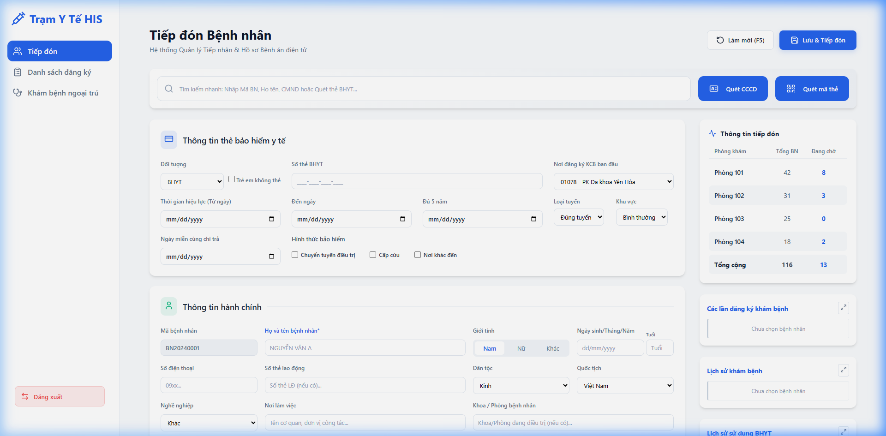
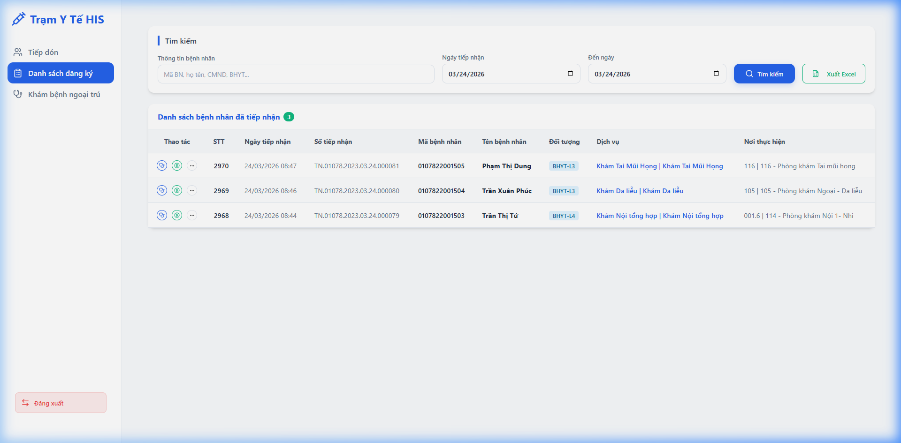
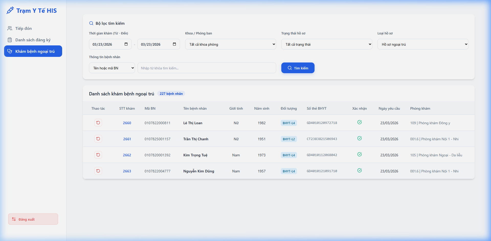
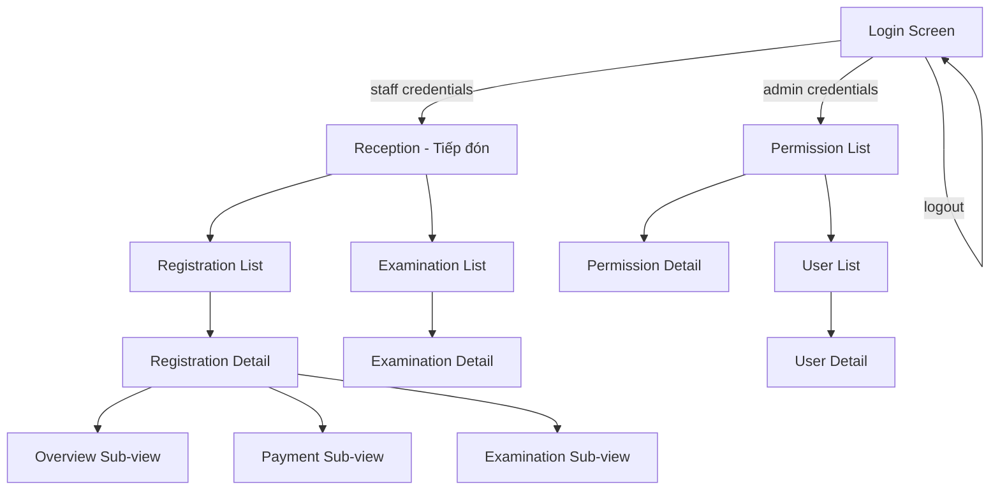

# Functional Specification Document

**Project**: Trạm Y Tế HIS (Health Information System)
**Type**: web-frontend
**Version**: 1.0
**Last Updated**: 2026-03-31

---

## 1. Feature Specifications

### 1.1 Authentication (auth)

**Description**: User authentication with role-based access (staff vs admin). Mock login with hardcoded credentials.

| ID | Requirement | Priority | Status |
|----|------------|----------|--------|
| FR-AUTH-001 | System supports login with username/password | Critical | Implemented |
| FR-AUTH-002 | System differentiates between "staff" and "admin" roles | Critical | Implemented |
| FR-AUTH-003 | Invalid credentials display Vietnamese error message | High | Implemented |
| FR-AUTH-004 | Login shows loading state during authentication | Medium | Implemented |
| FR-AUTH-005 | Logout terminates session and returns to login screen | Critical | Implemented |

**Use Case References**: [docs/usecases/auth/](usecases/auth/)

---

### 1.2 Reception / Patient Intake (reception)

**Description**: Patient reception module for registering new and returning patients. Captures insurance info, personal details, and registration data.

| ID | Requirement | Priority | Status |
|----|------------|----------|--------|
| FR-RCP-001 | Quick search by patient ID, name, CMND or BHYT card scan | Critical | Implemented |
| FR-RCP-002 | CCCD (citizen ID) and BHYT card scanning buttons | High | Implemented (UI only) |
| FR-RCP-003 | Health insurance (BHYT) information capture: card number, validity, coverage type, referral level | Critical | Implemented |
| FR-RCP-004 | Administrative info capture: name, gender, DOB, phone, ethnicity, nationality, occupation, address, identity docs | Critical | Implemented |
| FR-RCP-005 | Relative/next-of-kin info capture | High | Implemented |
| FR-RCP-006 | Registration details: intake number, queue number, admission date/time, designated service, clinic room | Critical | Implemented |
| FR-RCP-007 | Right sidebar: live clinic room stats (total patients, waiting count) | High | Implemented |
| FR-RCP-008 | View past registration records (popup) | High | Implemented |
| FR-RCP-009 | View medical history (popup) | High | Implemented |
| FR-RCP-010 | View BHYT card usage history (popup) | High | Implemented |
| FR-RCP-011 | Save & Admit button with confirmation modal | Critical | Implemented |
| FR-RCP-012 | Refresh/Reset form (F5 shortcut) | Medium | Implemented |

**Use Case References**: [docs/usecases/reception/](usecases/reception/)

---

### 1.3 Registration List (registration)

**Description**: Registry of all patient intake records. Supports search/filter, detail view, payment processing, and inline examination.

| ID | Requirement | Priority | Status |
|----|------------|----------|--------|
| FR-REG-001 | List all registered patients with sortable columns: STT, date, intake ID, patient ID, name, DOB, gender, CMND, target category, insurance, service, location | Critical | Implemented |
| FR-REG-002 | Filter by date range, department, search keyword | High | Implemented |
| FR-REG-003 | View registration detail page (insurance info, admin info, registration info) | Critical | Implemented |
| FR-REG-004 | Edit registration detail (toggle edit mode) | High | Implemented |
| FR-REG-005 | Delete registration record with confirmation | High | Implemented |
| FR-REG-006 | Print receipt button | Medium | Implemented (UI only) |
| FR-REG-007 | Navigate to Payment sub-view (cost breakdown, payment method, receipt number) | Critical | Implemented |
| FR-REG-008 | Navigate to Examination sub-view (inline clinical examination form) | Critical | Implemented |
| FR-REG-009 | Service order management (add services, view tree catalog, cart summary) | Critical | Implemented |
| FR-REG-010 | Prescription order management (add medications) | Critical | Implemented |
| FR-REG-011 | Medical history timeline (sidebar) | High | Implemented |
| FR-REG-012 | Full medical history modal with visit-detail split view (services + prescription tabs) | High | Implemented |
| FR-REG-013 | Right sidebar: clinic stats, past registrations, medical history, BHYT history panels | High | Implemented |

**Use Case References**: [docs/usecases/registration/](usecases/registration/)

---

### 1.4 Outpatient Examination (examination)

**Description**: Doctor's examination module for recording clinical observations, diagnosis, service orders, and prescriptions.

| ID | Requirement | Priority | Status |
|----|------------|----------|--------|
| FR-EXM-001 | Patient list view with search/filter (date range, department, status, record type, patient info) | Critical | Implemented |
| FR-EXM-002 | Click patient row to enter detailed examination view | Critical | Implemented |
| FR-EXM-003 | Patient summary bar (ID, name, gender, DOB, BHYT number) | High | Implemented |
| FR-EXM-004 | Clinical info: admission date/time, clinic room, symptoms, reason for visit | Critical | Implemented |
| FR-EXM-005 | Diagnosis: primary ICD-10, explanation, comorbidities (multi-select tags), treatment advice | Critical | Implemented |
| FR-EXM-006 | Treatment details: accident type, exam result, treatment type, physician, end date/time, treatment method, conclusion notes | Critical | Implemented |
| FR-EXM-007 | Vital signs card (pulse, temperature, BP min/max, respiratory rate, weight) | High | Implemented |
| FR-EXM-008 | Service orders table with pricing (unit price, total, BHYT amount, patient amount), physician, status checkboxes | Critical | Implemented |
| FR-EXM-009 | Add service orders via tree-based catalog modal | Critical | Implemented |
| FR-EXM-010 | Prescription table (drug name, active ingredient, unit, quantity, days, dosage instructions, pharmacy source) | Critical | Implemented |
| FR-EXM-011 | Add prescriptions via drug catalog modal | Critical | Implemented |
| FR-EXM-012 | Edit/View mode toggle | High | Implemented |
| FR-EXM-013 | Undo cost confirmation action | High | Implemented |
| FR-EXM-014 | Medical history sidebar with timeline and full history detail modal | High | Implemented |
| FR-EXM-015 | Print receipt action | Medium | Implemented (UI only) |

**Use Case References**: [docs/usecases/examination/](usecases/examination/)

---

### 1.5 Admin – Permission Management (admin)

**Description**: RBAC permission group management. CRUD operations on permission groups with detailed permission assignment per module.

| ID | Requirement | Priority | Status |
|----|------------|----------|--------|
| FR-ADM-001 | List all permission groups with code, name, user count, status | Critical | Implemented |
| FR-ADM-002 | Search permission groups by code or name | High | Implemented |
| FR-ADM-003 | Add new permission group via quick modal (code, name, description, status) | Critical | Implemented |
| FR-ADM-004 | Add new permission group via detail page (with per-module permission toggles) | Critical | Implemented |
| FR-ADM-005 | Edit permission group detail | High | Implemented |
| FR-ADM-006 | Delete permission group with confirmation | High | Implemented |
| FR-ADM-007 | Permission detail: toggle permissions per module (Tiếp đón, Đăng ký, Khám bệnh, Quản trị, Báo cáo) with granular view/add/edit/delete toggles | Critical | Implemented |

**Use Case References**: [docs/usecases/admin/](usecases/admin/)

---

### 1.6 Admin – User Management (admin)

**Description**: User account management with CRUD, role assignment, account locking/unlocking, and password management.

| ID | Requirement | Priority | Status |
|----|------------|----------|--------|
| FR-USR-001 | List all users with name, username, role, status | Critical | Implemented |
| FR-USR-002 | Search users by name or username | High | Implemented |
| FR-USR-003 | Add new user via detail page (personal info, account info, role, password, status) | Critical | Implemented |
| FR-USR-004 | Edit user details | High | Implemented |
| FR-USR-005 | Lock/Unlock user account with confirmation | High | Implemented |
| FR-USR-006 | Change user password with old password verification | High | Implemented |
| FR-USR-007 | Delete user with confirmation | High | Implemented |

**Use Case References**: [docs/usecases/admin/](usecases/admin/)

---

## 2. Screen Descriptions

### Login Screen
- **Purpose**: Authenticate users into the system
- **Layout**: Centered card with brand logo (Syringe icon), title, username/password fields, login button
- **Interactive Elements**: Username input, password input, login button (with loading spinner), demo credential hints
- **States**: Default, loading (button disabled + spinner), error (red banner)
- **Screenshot**: 

### Reception (Tiếp đón Bệnh nhân)
- **Purpose**: Register new patient visits — capture insurance, personal, and registration info
- **Layout**: Top action bar → Search/scan bar → 2-column (main form + right sidebar stats)
- **Interactive Elements**: Search input, CCCD/BHYT scan buttons, insurance form fields, personal info form, registration dropdowns, Save & Admit button, history expand modals
- **States**: Empty form (new patient), populated form (returning patient), confirmation modal
- **Screenshot**: 

### Registration List (Danh sách đăng ký)
- **Purpose**: View and manage all patient registrations
- **Layout**: Search filters → Patient table → Detail view (3 sub-modes: overview/payment/examination)
- **Interactive Elements**: Date range filters, department/status dropdowns, search input, row click to detail, action dropdown (edit/delete), print, payment, and examination navigation
- **States**: List view, detail overview, payment sub-view, examination sub-view
- **Screenshot**: 

### Outpatient Examination (Khám bệnh ngoại trú)
- **Purpose**: Doctor records clinical findings, diagnosis, services, and prescriptions
- **Layout**: List mode (search + table) → Detail mode (patient bar + clinical form + vitals + services + prescription + sidebar history)
- **Interactive Elements**: Search filters, patient table rows, edit/save/cancel buttons, ICD-10 diagnosis selectors, vital sign inputs, add service/prescription buttons, print button, undo cost confirmation
- **States**: List view, detail view (read-only), detail view (edit mode)
- **Screenshot**: 

### Permission Management (Phân quyền)
- **Purpose**: Admin creates/edits/deletes permission groups
- **Layout**: Header → Search bar → Permission table → Detail page with module permission toggles
- **Interactive Elements**: Search input, add button, row click to detail, action menu (edit/delete), per-module permission checkboxes
- **States**: List view, detail view (read/edit), add modal

### User Management (Người dùng)
- **Purpose**: Admin manages user accounts
- **Layout**: Header → Search bar → User table → Detail page
- **Interactive Elements**: Search input, add user button, row click to detail, action menu (edit/change password/lock/unlock/delete)
- **States**: List view, detail view, add user modal, change password modal, lock/unlock confirmation

---

## 3. Screen Flows

---

## 5. Data Models

### Patient (Bệnh nhân)

| Field | Type | Constraints | Description |
|-------|------|-------------|-------------|
| patientId | string | PK | Unique patient code (e.g., 0107822001505) |
| name | string | required | Full name |
| gender | enum | Male/Female/Other | Gender |
| dob | date | required | Date of birth |
| phone | string | | Phone number |
| ethnicity | string | | Ethnic group (e.g., Kinh) |
| nationality | string | | Country (e.g., Việt Nam) |
| occupation | string | | Job title |
| workplace | string | | Employer name |
| address | string | | Residential address |
| province | string | | Province/city |
| ward | string | | Ward/commune |
| village | string | | Village/hamlet |
| identityNumber | string | | CCCD/Passport number |
| identityIssueDate | date | | ID issue date |
| identityIssuePlace | string | | ID issuing authority |
| relativeName | string | | Next-of-kin name |
| relativeRelation | enum | | Relationship type |
| relativeCccd | string | | Next-of-kin CCCD |
| relativePhone | string | | Next-of-kin phone |
| relativeAddress | string | | Next-of-kin address |

### Insurance Card (Thẻ BHYT)

| Field | Type | Constraints | Description |
|-------|------|-------------|-------------|
| cardNumber | string | PK | BHYT card number |
| patientId | string | FK → Patient | Owner patient |
| objectType | enum | BHYT/Dịch vụ | Coverage type |
| registrationFacility | string | | Initial KCB registration facility code |
| validFrom | date | | Effective from |
| validTo | date | | Effective until |
| fiveYearDate | date | | Date reaching 5 years continuous |
| referralType | enum | | In-network/out-of-network |
| area | enum | | Region classification |
| coPayExemptDate | date | | Co-payment exemption date |

### Registration (Đăng ký khám)

| Field | Type | Constraints | Description |
|-------|------|-------------|-------------|
| intakeId | string | PK | Intake registration ID |
| patientId | string | FK → Patient | Patient reference |
| queueNumber | int | auto | Queue sequence number |
| admissionDate | date | required | Admission date |
| admissionTime | time | required | Admission time |
| orderTime | time | | Medical order time |
| service | string | required | Designated service |
| clinicRoom | string | required | Assigned clinic room |
| notes | text | | Notes |

### Examination Record (Hồ sơ khám bệnh)

| Field | Type | Constraints | Description |
|-------|------|-------------|-------------|
| examId | string | PK | Examination record ID |
| registrationId | string | FK → Registration | Registration reference |
| symptoms | text | | Symptoms / clinical progression |
| visitReason | text | | Reason for visit |
| primaryDiagnosis | string | | Primary ICD-10 code |
| primaryDiagnosisDesc | text | | Primary diagnosis explanation |
| comorbidities | string[] | | Comorbidity ICD-10 codes |
| comorbiditiesDesc | text | | Comorbidities explanation |
| treatmentAdvice | text | | Treatment consultation notes |
| treatmentProgress | text | | Treatment progression notes |
| accidentType | enum | | Accident classification |
| examResult | enum | | Outcome (unchanged/cured/improved) |
| examType | enum | | Type of medical care |
| physician | string | | Attending physician |
| endDate | date | | Examination end date |
| endTime | time | | Examination end time |
| treatmentMethod | enum | | Western/Eastern/Combined |
| conclusionNotes | text | | Final conclusion notes |

### Vital Signs (Chỉ số sinh tồn)

| Field | Type | Constraints | Description |
|-------|------|-------------|-------------|
| examId | string | FK → Examination | Parent examination |
| pulse | number | | Pulse rate |
| temperature | number | | Body temperature |
| bpMin | number | | Blood pressure (diastolic) |
| bpMax | number | | Blood pressure (systolic) |
| respiratoryRate | number | | Respiratory rate |
| weight | number | | Body weight (kg) |

### Service Order (Chỉ định dịch vụ)

| Field | Type | Constraints | Description |
|-------|------|-------------|-------------|
| orderId | string | PK | Service order ID |
| examId | string | FK → Examination | Parent examination |
| serviceName | string | required | Service name |
| requestDate | datetime | | Date/time requested |
| priceType | enum | | Price category (BHYT/Service) |
| quantity | int | default 1 | Service quantity |
| unitPrice | decimal | | Unit price |
| totalPrice | decimal | | Computed: unitPrice × quantity |
| bhytAmount | decimal | | Amount covered by BHYT |
| patientAmount | decimal | | Amount paid by patient |
| physician | string | | Ordering physician |
| resultStatus | boolean | | Result completed flag |
| feeStatus | boolean | | Fee confirmed flag |

### Prescription (Đơn thuốc)

| Field | Type | Constraints | Description |
|-------|------|-------------|-------------|
| prescriptionId | string | PK | Prescription line ID |
| examId | string | FK → Examination | Parent examination |
| drugName | string | required | Drug name |
| activeIngredient | string | | Active ingredient |
| unit | string | | Dosage unit (Viên, Tuýp, Lọ) |
| quantity | int | required | Total quantity |
| days | int | | Treatment duration in days |
| dosageInstructions | text | | Usage/dosage instructions |
| source | string | | Pharmacy/warehouse source |

### Permission Group (Nhóm quyền)

| Field | Type | Constraints | Description |
|-------|------|-------------|-------------|
| id | string | PK | Permission group code |
| name | string | required | Group name |
| description | text | | Description |
| userCount | int | computed | Number of assigned users |
| status | enum | Active/Locked | Group status |

### User (Người dùng)

| Field | Type | Constraints | Description |
|-------|------|-------------|-------------|
| id | string | PK | User ID |
| username | string | unique, required | Login username |
| fullname | string | required | Full name |
| email | string | required | Email address |
| phone | string | | Phone number |
| role | string | FK → Permission | Assigned permission group |
| password | string | required, min 6 | Hashed password |
| status | enum | Active/Locked | Account status |

---

## 6. Business Rules & Validations

| ID | Rule | Applies To | Enforcement |
|----|------|-----------|-------------|
| BR-001 | Only "admin" role can access Permission and User management | Navigation | Client |
| BR-002 | Only "staff" role can access Reception, Registration, Examination modules | Navigation | Client |
| BR-003 | Login fails for unknown username/password combinations | Authentication | Client (mock) |
| BR-004 | Patient name is mandatory for registration | Reception | Client |
| BR-005 | BHYT card number must follow ____-____-____-____ format | Reception | Client (placeholder hint) |
| BR-006 | Username for new users must be lowercase alphanumeric with underscores only | Admin - Users | Client |
| BR-007 | Password minimum length is 6 characters | Admin - Users | Client |
| BR-008 | Password confirmation must match the password field | Admin - Users | Client |
| BR-009 | Email must be a valid email format | Admin - Users | Client |
| BR-010 | Permission code and name are required to create a permission group | Admin - Permissions | Client |
| BR-011 | Deleting a permission group or user requires explicit modal confirmation | Admin | Client |
| BR-012 | Lock/Unlock user toggle requires confirmation | Admin - Users | Client |
| BR-013 | ICD-10 coding system is used for primary and comorbidity diagnoses | Examination | Client |
| BR-014 | Service pricing auto-calculates BHYT and patient amounts | Examination | Client |
| BR-015 | Queue number is auto-generated sequentially per clinic room per day | Registration | Client (mock) |

---

## 7. Non-Functional Requirements

| Category | Requirement | Target |
|----------|------------|--------|
| Performance | Page load time under 2 seconds | < 2s |
| Performance | Smooth animations on modals and transitions | 60fps CSS animations |
| Responsiveness | Sidebar + main content layout adapts to screen width | Desktop-first (1280px+) |
| UX | Vietnamese language throughout the interface | 100% Vietnamese labels |
| UX | Modern design with Inter font, blue accent (#2563eb), glassmorphism modals | Design system compliance |
| Security | Role-based route guarding (staff vs admin) | Client-side enforcement |
| Security | Password fields masked by default with show/hide toggle | Admin user forms |
| Accessibility | All form fields have associated labels | Semantic HTML |
| Technology | React 18+ with Vite, react-router-dom, lucide-react icons | Tech stack |
